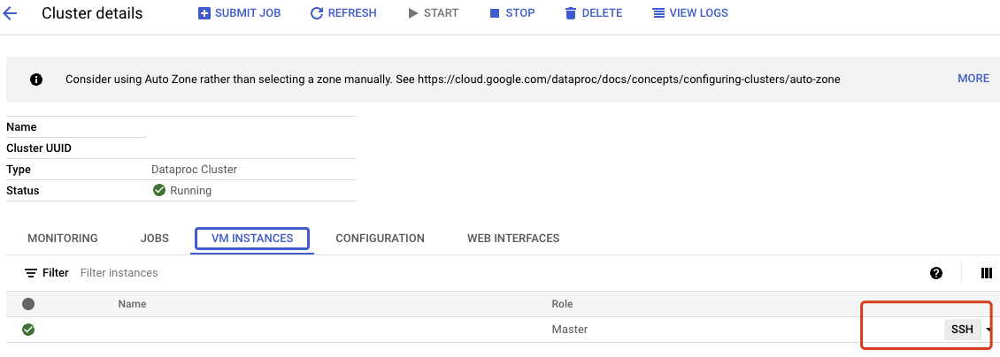
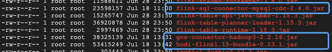
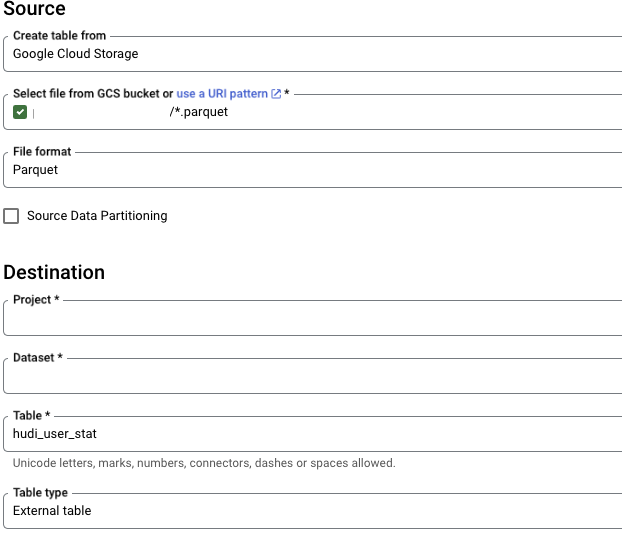
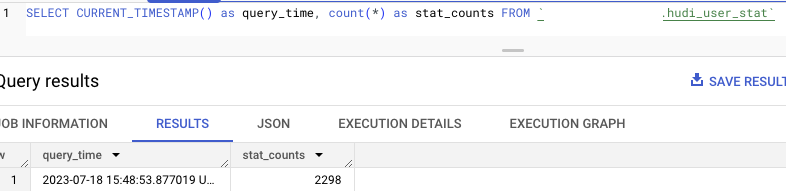
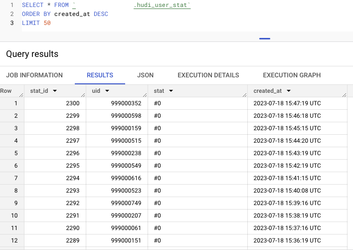
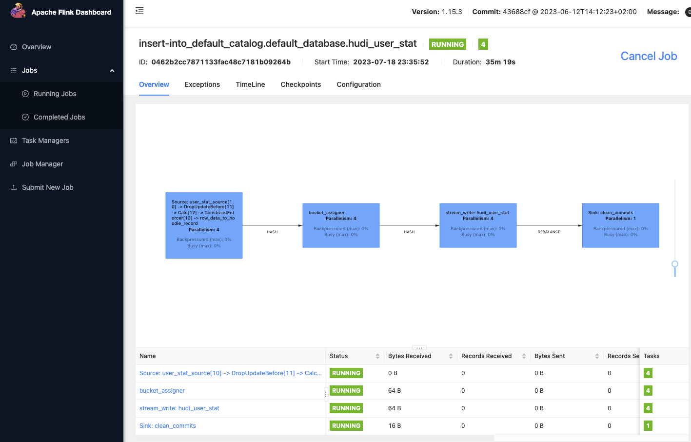
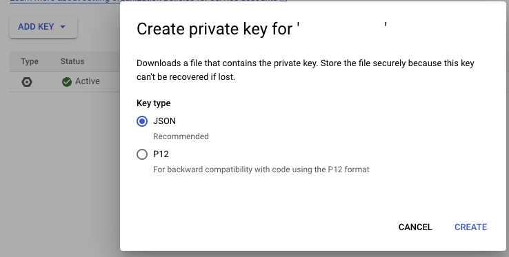
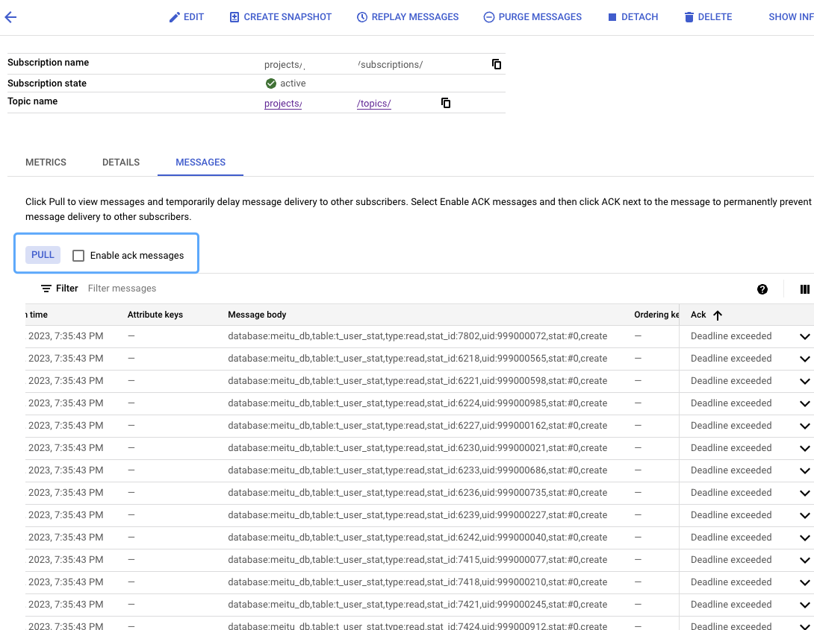
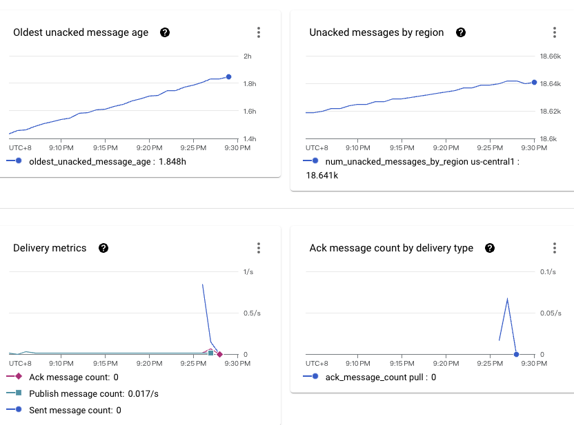

# ETL DEMO by flink

## data flow
1. Real-time OLAP: mysql cdc -> flink on Dataproc -> Hudi on GCS -> BigQuery External Table
2. Real-time Monitoring: mysql cdc -> flink on Dataproc -> Pub/Sub

## Resources

- code: https://github.com/ping-coder/gcp-demo/solutions/etl/flink/
- Dataproc 2.1 (optional components - flink and hudi)
- Flink libaries:
- - Flink mysql cdc jar: [flink-sql-connector-mysql-cdc-2.4.0.jar]{https://repo1.maven.org/maven2/com/ververica/flink-sql-connector-mysql-cdc/2.4.0/flink-sql-connector-mysql-cdc-2.4.0.jar}
- - Flink hudi bundler: [hudi-flink1.15-bundle-0.13.1.jar]{https://repo1.maven.org/maven2/org/apache/hudi/hudi-flink1.15-bundle/0.13.1/hudi-flink1.15-bundle-0.13.1.jar}
- - gcs connector: [gcs-connector-hadoop3-2.2.16.jar]{https://repo1.maven.org/maven2/com/google/cloud/bigdataoss/gcs-connector/hadoop3-2.2.16/gcs-connector-hadoop3-2.2.16-shaded.jar}
- Dataproc Flink component doc: https://cloud.google.com/dataproc/docs/concepts/components/flink

## Data source
Cloud sql - mysql ( binlog enabled )
table: t_user_stat
Scheduler: run 1 time per minute ( one record per minute in table )
code: https://github.com/ping-coder/gcp-demo/solutions/etl/flink/data_gen

enable binlog:
```bash
gcloud sql instances patch INSTANCE_NAME —-enable-bin-log
```

## DEMO - Real-time OLAP
script: https://github.com/ping-coder/gcp-demo/solutions/etl/flink/flink-gcs

1. ssh connect dataproc cluster master:


2. download Flink libaries and copy them to /usr/lib/flink/lib/


3. Modify flink-conf.yaml: (/usr/lib/flink/conf/flink-conf.yaml)
```yaml
taskmanager.numberOfTaskSlots: 12
parallelism.default: 2
```
4. Run yarn-session in dataproc master:
```bash
sudo /usr/lib/flink/bin/yarn-session.sh \
 -s 1 \
 -jm 2048m \
 -tm 2048m \
 -nm flink-dataproc \
 --detached
```

5. Run sql-client and set tableau:
```bash
sudo /usr/lib/flink/bin/sql-client.sh
Flink SQL> set sql-client.execution.result-mode = tableau;
```

6. create mysql cdc table:
```bash
Flink SQL> CREATE TABLE user_stat_source (
    db_name STRING METADATA FROM 'database_name' VIRTUAL,
    table_name STRING METADATA  FROM 'table_name' VIRTUAL,
    operation_ts TIMESTAMP_LTZ(3) METADATA FROM 'op_ts' VIRTUAL,
    stat_id int NOT NULL,
    uid int,
    stat VARCHAR(30),
    created_at TIMESTAMP(0),
    PRIMARY KEY (`stat_id`) NOT ENFORCED
)
WITH (
    'connector' = 'mysql-cdc',
    'hostname' = 'ip address',
    'port' = '3306',
    'username' = 'db_user',
    'password' = password',
    'database-name' = 'demo_db',
    'table-name' = 't_user_stat'
);
```

7. create hudi table:
```bash
Flink SQL> create table hudi_user_stat(
    stat_id int NOT NULL,
    uid int,
    stat VARCHAR(30),
    created_at TIMESTAMP(0),
    `partition` VARCHAR(20),
    PRIMARY KEY (`stat_id`) NOT ENFORCED
)
PARTITIONED BY (`partition`)
WITH (
    'connector' = 'hudi',
    'path' = 'gs://demo/raw',
    'table.type' = 'COPY_ON_WRITE',
    'read.streaming.enabled' = 'true',
    'read.streaming.check-interval' = '1'
);
```

8. insert mysql cdc data into hudi table:
```bash
Flink SQL> set execution.checkpointing.interval=30sec;
Flink SQL> insert into hudi_user_stat
select stat_id, uid, stat, created_at,
       DATE_FORMAT(CURRENT_TIMESTAMP,'yyyyMMdd_HHmm') as `partition`
from user_stat_source;
```

9. create external table in BigQuery:



10. query data with bigquery:




11. view the job in flink ui: ( dataproc cluster details -> web interfaces - applications running -> select running application -> Tracking URL: ApplicationMaster )



## Real-time Monitoring

code: https://github.com/ping-coder/gcp-demo/solutions/etl/flink/flink-pub

1. Create new java project:
```bash
mvn archetype:generate                               \
      -DarchetypeGroupId=org.apache.flink              \
      -DarchetypeArtifactId=flink-quickstart-java      \
      -DarchetypeVersion=1.15.3
```

2. Modify pom.xml to add dependencies ( pls note the flink version: 1.15.3 )
3. create stream execute class: ping.code.sample.StreamingJob
   - Source: com.ververica.cdc.connectors.mysql.MySqlSource
   - Sink: org.apache.flink.streaming.connectors.gcp.pubsub.PubSubSink
   - DeserializationSchemaFunction:  cdc json to string message, like:
    database:demo_db,table:t_user_stat,type:read,stat_id:1088,uid:999000626,stat:#0,created_at:1689622397000
   - Download and add service account key to resource folder:
    
4. mvn package
    - flink-pubsub-1.0-SNAPSHOT.jar for run job
    - target/pack/lib/*.jar for runtime dependencies
5. upload target/pack/lib/* to flink folder: /usr/lib/flink/lib
6. submit job ( perhaps you prefer to submit to a remote cluster, but this demo still uploads the jar package and submits it locally )
```bash
sudo flink run flink-pubsub-1.0-SNAPSHOT.jar
```
7. test pull message in pub/sub:

8. Go to metrics of the subscription:
